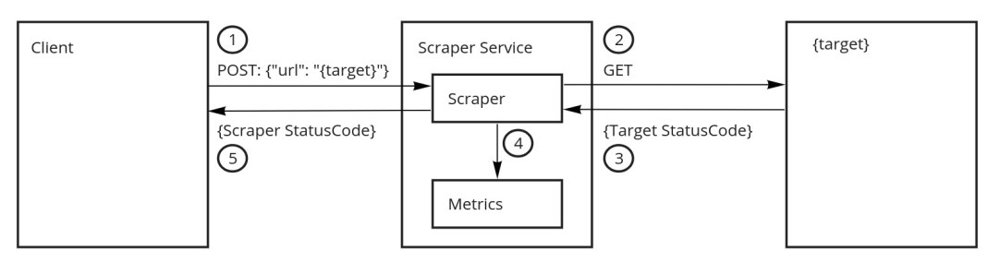

Scraper is a web service that grabs the HTTP response status codes for a given URL.

## Main features

- Custom listen ports for scraper service and metrics service
- Limit of concurrent scrapes
- Custom timeout
- Settings via command line arguments or environment variables (SCRAPER\_ prefix)

## How it works?



1. A client makes a HTTP POST request to the Scraper Service, to the Scraper listening port (default: 8080). The request is sent in the POST body:

   ```POST Body
   {"url": "http://phaidra.ai"}
   ```

2. The Scraper tries to fullfil the request by creating an HTTP GET request to {target}

3. If the {target} url exists, Scraper receives the Status Code response from {target}

4. The following prometheus metrics are updated:

   - http_requests_total{code}
     - How many HTTP requests received, partitioned response code.
   - http_get{code}
     - How many HTTP GET scraped, partitioned by url and response code.
   - workerWait
     - Histogram. Time waiting for an available worker. In milliseconds.

5. Client receives the response Status Code:
   - 200 OK: Target exists and replied with a Status Code
   - 408 RequestTimeout: No worker available in the timeout period
   - 501 NotImplemented: Scaper received a HTTP method different than POST
   - 400 BadRequest: Request POST body is malformed
   - 500 InternalServerError: Unexpected internal error

## Build and run Scraper

Requirements:

- Golang [go1.16](https://golang.org/dl/)

Compile and install:

```bash
$ go build .
```

Run Unit Tests:

```bash
$ go test .
```

Start Scraper Service:

```bash
$ ./scraper_service
```

Scraper Service settings:

```bash
$ ./scraper_service --help

Usage: scraper_service [FLAG]...

Flags:
    --listen      Service listen address.                                 (type: string; env: SCRAPER_Listen; default: :8080)
    --workers     Number of serving workers.                              (type: uint8; env: SCRAPER_Workers; default: 2)
    --timeout     Maximum time (in milliseconds) to wait for a worker.    (type: uint64; env: SCRAPER_Timeout; default: 1000)
    --metrics     Metrics listen address.                                 (type: string; env: SCRAPER_MetricsListen; default: :9095)
    -h, --help    show help                                               (type: bool)
```

## Build docker images

This builds the docker image `scraper_service/scraper:0.1.0` using a multi-stage build

```bash
docker build -t scraper_service/scraper:0.1.0 .
```

## Simple request script

```bash
./tools/request.sh <address-to-scrape> <scraper-service-address> <count>
```

## PromQL

Number of requests received per `10s`:

```PromQL
sum(rate(http_requests_total[10s]))
```

Number of requests received per `10s`, partitioned by `Status Code`:

```PromQL
sum by(code) (delta(http_requests_total[10s]))
```

Number of requests received per `1m`, where `Status Code` was not `200 OK`:

```PromQL
delta(http_requests_total{code!="200"}[1m])
```

Number of requests received that resulted in timeout, per `1m`:

```PromQL
delta(http_requests_total{code!="408"}[1m])
```

Number of requests that waited for a worker, per bucket of wait time, per `1m`:

```PromQL
sum by (le) (rate(wait_available_worker_bucket[1m]))
```

Average wait time for a worker to process the request, per 1m:

```PromQL
sum(wait_available_worker_sum/wait_available_worker_count)
```

## Kubernetes deployment

Image should be available in your cluster.

[Kind](https://kind.sigs.k8s.io/) example:

```bash
kind load docker-image scraper_service/scraper:0.1.0
```

Deploying the Scraper Service:

```bash
kubectl apply -f deployment/scraper.yaml
```

Deploying the Prometheus with service discovery:

```bash
kubectl apply -f deployment/prometheus-rbac.yaml
kubectl apply -f deployment/prometheus.yaml
```
